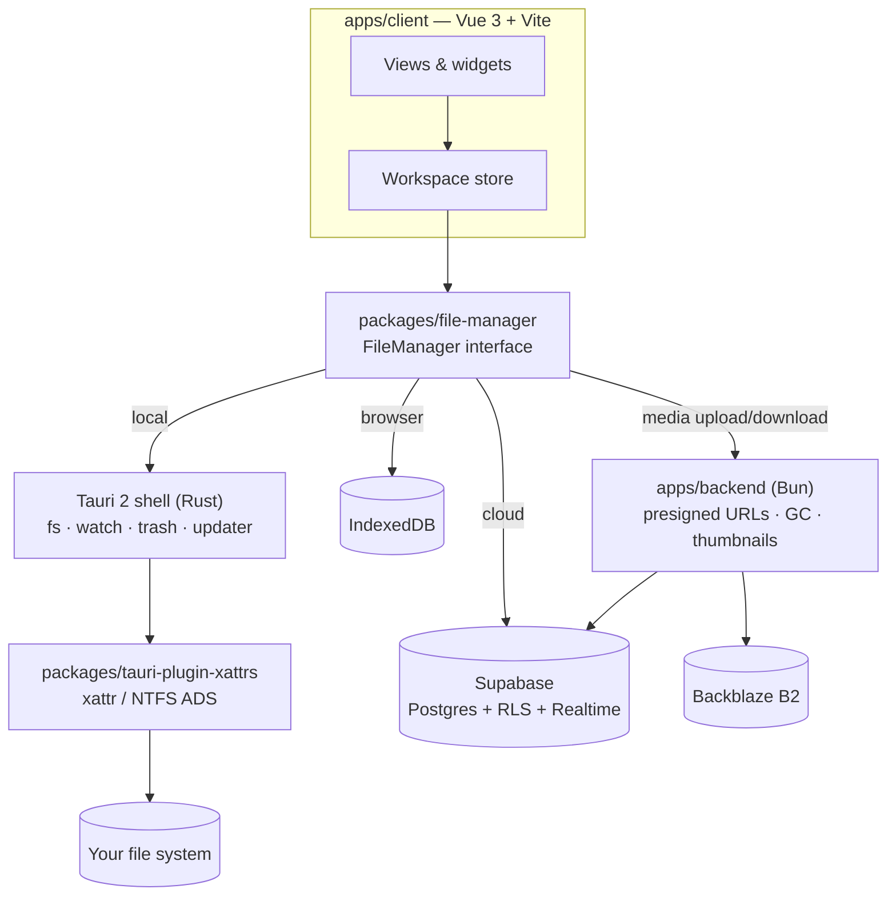

# Pile Commander

**File manager with unusual possibilities**

Open a folder as a list, a grid, a board, a canvas, a stack, a tiled wall or slides.
Everything the app knows about a file or folder (its view, position, size, order,
background) is written into that file's own extended attributes, not into an app
database.

[Website and live demo](https://www.pile-commander.com) ·
[Download for desktop](https://github.com/a-matyukh/pile-commander/releases/latest)

> [!NOTE]
> Pile Commander is in beta. If you have suggestions or any feedback, it would be very much appreciated — you can send it from the [feedback page](https://www.pile-commander.com/feedback).

<a href="https://www.producthunt.com/products/pile-commander?embed=true&utm_source=badge-featured&utm_medium=badge&utm_campaign=badge-pile-commander-2" target="_blank" rel="noopener noreferrer"></a>


https://github.com/user-attachments/assets/365745eb-7503-464c-b09d-1fd607cb8244


## The idea

Most "spatial" note and board apps keep your stuff in their own database, and
exporting it gives you a pile of files with the arrangement thrown away. Pile
Commander goes the other way:

- **A workspace is a folder.** The desktop app works on the folders you
already see in Finder or Explorer. Nothing is imported or copied.
- **All metadata lives on the files.** Every attribute of a file or folder
(`view`, `position`, `size`, `order`, `background` and the rest) is a
key/value pair stored on that file or folder: xattrs on macOS and Linux,
alternate data streams on NTFS.
- **Moving between file systems.** When the metadata has to survive a file
system that drops xattrs (email, a USB stick, a zip upload), a `.pile`
archive carries it along: a zip of the folder plus a `.pile/attrs.json`
manifest.
- **The same model locally, in the browser and in the cloud.** One
`FileManager` interface has a disk backend, an IndexedDB backend and a
Postgres backend. The UI does not know which one it is talking to.

```text
Research/                     user.view = "board"   user.background = "dots"
├── References/               user.view = "grid"
│   └── harbor-01.jpg         user.position = {"x":120,"y":48}  user.size = {"w":240,"h":180}
├── Mood.md                   user.position = {"x":40,"y":300}  user.order = 2
└── .pile/                    ink strokes and connector lines for the canvas view
```

If you delete Pile Commander, your folders, files and their names stay
exactly as they were.

https://github.com/user-attachments/assets/60fae415-5e05-4eff-b6fb-3656586da096


## What's in a folder


|                        |                                                                                                                                                                                                                                                                  |
| ---------------------- | ---------------------------------------------------------------------------------------------------------------------------------------------------------------------------------------------------------------------------------------------------------------- |
| **7 views per folder** | List and Grid (classic), Board and Canvas (spatial), Stack, Masonry and Slides (ordered). Each folder remembers its own view.                                                                                                                                    |
| **Widgets**            | A widget is a live preview of a file or folder placed in the view: a Markdown note you edit in place, an image, a video, audio, a PDF, a 3D model (`<model-viewer>`), a link preview, a shape, or a nested folder that you can browse without leaving the board. |
| **Canvas tools**       | Freehand ink and connector lines between items, built on Vue Flow.                                                                                                                                                                                               |
| **Live disk sync**     | The desktop app watches the file system, so changes made in Finder, a terminal or another editor show up on the board.                                                                                                                                           |
| **Cloud workspaces**   | Members edit in real time, a workspace can be published at a public URL, listed on the Hub, and forked when the owner allows it.                                                                                                                                 |


## Architecture




| Package                                                        | What it does                                                                                                                                                                                                                                                                                                                                           |
| -------------------------------------------------------------- | ------------------------------------------------------------------------------------------------------------------------------------------------------------------------------------------------------------------------------------------------------------------------------------------------------------------------------------------------------ |
| [`apps/client`](apps/client)                                   | The app. One Vue 3 + Vite codebase that ships as a desktop app (Tauri, `src-tauri/`), a web app and an installable PWA. Tailwind 4 and Nuxt UI, plus interact.js and Vue Flow for spatial layout.                                                                                                                                                      |
| [`packages/file-manager`](packages/file-manager)               | The storage layer. The `FileManager` interface and its backends: `local` (Tauri fs + xattrs), `browser` (IndexedDB), `cloud` (Supabase), plus `demo`, `fake` and `mock` for tests. It also owns the `.pile` manifest format and the database: [`schema.sql`](packages/file-manager/src/schema.sql) and [`rpc.sql`](packages/file-manager/src/rpc.sql). |
| [`packages/tauri-plugin-xattrs`](packages/tauri-plugin-xattrs) | A small, self-contained Tauri v2 plugin that reads and writes extended attributes on Linux, macOS, BSD and Windows. [Docs](packages/tauri-plugin-xattrs/README.md).                                                                                                                                                                                    |
| [`apps/backend`](apps/backend)                                 | A Bun HTTP server with a deliberately small surface: it issues short-lived presigned URLs, finalizes uploads, re-keys blobs for forks, generates image and video thumbnails, and runs GC and account deletion. Everything else is the client talking to Postgres under RLS.                                                                            |
| [`apps/landing`](apps/landing)                                 | The Nuxt marketing site, including a Three.js scene.                                                                                                                                                                                                                                                                                                   |


### Notes on the design

- **Storage-agnostic UI.** Every view talks to `FileManager`: entries,
`set_xattrs`, `folder_with_children_xattrs`, `watch`, strokes and
connections. Adding a backend means implementing that interface. Most UI
tests run against the in-memory `fake` backend.
- **Postgres is the authorization layer.** Every table has RLS, policies use
`(select auth.uid())` with helper sets for readable and writable
workspaces, and the service role is only used inside the backend.
[`rls.test.sql`](packages/file-manager/src/rls.test.sql) checks grants,
policies and RPCs for every role inside a transaction that rolls back.
- **Clients never get write access to a stored object.** Uploads go to a
staging key and are then copied to a key the client could never write.
- **Desktop releases are built in CI.** A `v`* tag builds the app in GitHub
Actions for macOS (Apple silicon and Intel), Linux and Windows, and signs
the update artifacts the Tauri updater checks.


## Get Pile Commander

**Try it in the browser.** Open [pile-commander.app](https://www.pile-commander.app)
and start the demo, or open the app directly. Browser workspaces are stored
in the browser's IndexedDB and need no account. You can also install the web
app from the browser as a PWA.

**Download the desktop app.** It works directly on the folders on your disk.
Builds for every platform are on the
[latest release](https://github.com/a-matyukh/pile-commander/releases/latest):


| OS                   | File                          |
| -------------------- | ----------------------------- |
| macOS, Apple silicon | `.dmg` (`aarch64`)            |
| macOS, Intel         | `.dmg` (`x64`)                |
| Windows              | `.msi` or `.exe` installer    |
| Linux                | `.AppImage`, `.deb` or `.rpm` |


The desktop app updates itself when a new release comes out.

> [!NOTE]
> Windows SmartScreen says the publisher is unknown: choose **More info**, then **Run anyway**.
> A downloaded Linux `.AppImage` is not executable until you run `chmod +x` on the file. `.deb` and `.rpm` install as usual.

**Use the cloud.** Sign in from the app to create a cloud workspace,
invite people, or publish a workspace at a public link. Local folders and
browser workspaces keep working without an account.
