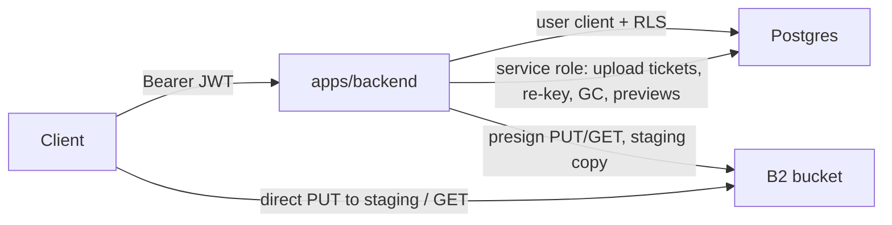

# Security model and hardening log

Auth is JWT + RLS; this server only issues short-lived presigned URLs, creates
blob rows, re-keys forked blobs, runs GC and account deletion. The public
`VITE_BACKEND_URL` is not a secret.

Schema: `packages/file-manager/src/schema.sql`, RPCs: `rpc.sql`. Regression
suite for grants/policies/RPCs: `packages/file-manager/src/rls.test.sql`
(runs in a transaction and rolls back; every row must be `ok = true`).

### Advisors

After every schema change, `get_advisors` (security + performance) should
show only these intentional INFOs. Anything else is a regression.

| lint | why it stays |
| --- | --- |
| `rls_enabled_no_policy` (`billing_events`, `blob_deletions`, `plan_launch_subscribers`, `feedback`, `egress_daily`, `download_daily`, `egress_notices`, `entry_derivatives`, `moderation_mail`, `moderation_digest_state`) | service-role-only tables: RLS on, no client policies. Do not add anon/authenticated policies to "fix" the lint. |
| `auth_leaked_password_protection` | Pro-plan feature; on Free set min password length + required character classes in Auth settings (rollout checklist) |

---

## Invariants the code relies on

- **A client never holds write access to a referenced object.** Bun's
  `s3.presign` signs neither `content-length` nor arbitrary headers (`type` /
  `contentDisposition` become `response-*` GET overrides), and B2 offers no
  POST policy here — so a PUT URL can cap nothing, and it stays replayable
  until it expires. It is therefore only ever issued for a **staging** key,
  `uploads/<blob|hub_preview>/<workspace_id>/<uuid>[.ext]`, minted by the
  service-role-only `register_upload` together with a row in
  `private.upload_sessions` binding it to the uploader, the workspace and a
  TTL. `/finalize` copies staging to a **fresh key the client has never been
  able to write** and records only that copy, so replaying the PUT afterwards
  changes an object nothing references. Nothing is trusted about the source
  except its bytes: the `stat` is a preflight, the copy itself runs through
  `limited_stream` (`src/streams.ts`), the stored object is `stat`ed again,
  and the entry is written only if that size matches what was copied. Every
  attempt writes its own key, so concurrent or retried finalizes never
  collide. `POST /presign/upload` is 30/min per account, `/finalize` 60/min.
  `size_bytes` in the presign body remains a client claim used for the quota
  preflight only.
  Residual, accepted: the copy's Content-Type is `entries.mime`, a client
  claim, so a presigned GET can still serve an attacker-chosen Content-Type —
  from the B2 host, which is a different origin from the app, under a
  15-minute URL. The staging object keeps whatever the uploader sent, and is
  never served.
- **A finalize is idempotent and never deletes.** `prepare_upload` binds the
  ticket to the first request body it sees (a mismatched retry is
  `upload_conflict`, 409) and `complete_upload` writes the entry and the
  receipt in one transaction, so a repeat returns the original entry instead
  of a second one. Nothing on the failure path deletes an object: an RPC error
  can mean a committed transaction whose response was lost, and the old
  `delete on refused insert` could therefore reclaim a blob a live row already
  pointed at. Unused copies and consumed staging keys are left to reconcile.
- **Reconcile owns every abandoned object.** It runs **hourly** and treats a
  managed key with no row as an orphan once it is older than
  `max(RECONCILE_GRACE_HOURS, PRESIGN_PUT_TTL_SECONDS + 30 min)`
  (`orphan_grace_hours` in `src/gc.ts`) — an object cannot be written after its
  PUT URL expires, and that floor also covers a ticket's life, so past it the
  object is abandoned rather than in-flight. `uploads/` is a managed family in
  `is_managed_key` but deliberately **not** in `KEY_SOURCES`: no row ever
  references staging, so every staged object is reclaimed after the grace,
  finalized or not. End to end an object still lives for detection latency +
  that grace + `GC_MIN_AGE_HOURS`: with the defaults (hourly, 24, 24) about
  49 h. The grace dominates, so `RECONCILE_GRACE_HOURS` is the lever if that
  has to shrink — and lowering it is safe, because the
  `PRESIGN_PUT_TTL_SECONDS + 30 min` floor keeps it above the life of an
  upload URL no matter what it is set to. `GC_MIN_AGE_HOURS` is the deliberate
  recovery window for an accidental workspace or account delete and is a
  separate decision.
- **GC asks per key, never by counting rows.** `blob_references` is a
  service-role-only RPC returning one JSON object with an explicit boolean for
  every queued key. A plain `select … in (keys)` was wrong: PostgREST caps the
  response at `max_rows` (1000), so a single key with 1000 copies filled it and
  the one live reference to a different key fell off the end — and GC deleted a
  live blob. Any missing key, non-boolean answer or failed call keeps the whole
  batch. Raising `max_rows` would only move the threshold.
- **Blob rows are server-made.** Clients cannot mention `storage_key` or
  `size_bytes` at all (column-level INSERT/UPDATE grants on `entries`).
  `create_blob_entry` is service-role-only and checks the key prefix
  (`<workspace_id>/…`), the caller's write access, the owner quota and the row
  ceiling in one transaction — the same transaction that consumes the ticket.
- **Text rows are made by `create_text_file`** (entries + entry_contents in
  one transaction). Direct client INSERTs on `entries` are folders only.
- **One writer at a time reshapes a workspace tree.** A transaction is atomic
  but not serializable here: `rename_entry` / `move_entry` / `copy_entry` and
  friends read a subtree's paths, then rewrite descendants by cutting a prefix
  of the *old* length. Two of them interleaved produced paths like
  `/otherong/file.txt` — a real corruption, not a lost update. Every
  structural RPC now calls `private.lock_entry_workspace` **before its first
  read**, and a direct folder INSERT takes the same lock through the
  `entries_00_tree_lock` trigger (it sorts first, so it runs before
  `entries_derive_paths` observes the parent). `purge_expired_entries` gives
  the pg_cron sweep the same discipline. The lock is `for no key update` on
  `workspaces`, not `for update`: a plain text save takes a `key share` FK
  lock on the same row while holding the owner's billing lock, and the
  stronger mode would deadlock against it. Lock order is
  workspace → ticket/billing → entries, everywhere. Payload and xattr UPDATEs
  take no workspace lock at all, so notes keep saving while a folder is being
  renamed — `postgres.test.ts` asserts both halves with two connections.
- **No client hard delete.** `remove()` is `delete_entry` (soft); hard
  deletes happen only via `purge_entry`/`purge_trash`, pg_cron (30 days) and
  FK cascades. The GC executes queued blob deletions only after
  `GC_MIN_AGE_HOURS` (default 24) — the recovery window for an accidental
  workspace/account delete. Preview rows (`entry_derivatives`) are retired
  by `prune_entry_derivatives` in the daily reconcile once no entry
  references their blob — a sweep, because a fork's re-key drops the last
  reference with an UPDATE, not a DELETE; the row delete queues the object.
- **Trash is for writers.** Readers (anon on a public board, viewers) see
  live rows only; `GET /presign` refuses trashed rows. A 2-minute grace after
  `deleted_at` lets the soft-delete Realtime event reach readers. This covers
  `entries`, `entry_contents`, **and** `folder_strokes` / `folder_connections`:
  their SELECT policies scoped by workspace alone until 0001, so a plain
  PostgREST read returned the ink and edges of a trashed folder for the 30 days
  before the hard delete. All four now carry the same live-entry branch.
- **Memberships come from `add_workspace_member`.** No client INSERT on
  `workspace_members` or `workspace_invites`. A registered email becomes a
  member; otherwise a pending invite (14-day token). Share never oracles
  whether the address already has an account (`Added` / `Invite sent`;
  `no user with email` is gone). `handle_new_user` converts live pending
  rows after signup. The owner may change `role` or remove a member or
  pending row directly. Invite mail is `POST /workspace/invite` (Plunk),
  not the client, and is capped (20 live pending per owner in SQL; 10 mails
  / hour / user and 30 / hour / IP on the backend — not PostgREST alone).
- **Blob sharing is by design within a workspace.** `copy_entry` clones point
  at the same immutable object; the GC keeps an object while any row
  references it. Only forks (foreign key prefix) are re-keyed — by
  `/blobs/copy-clones` right after the fork and, as the guarantee, by the GC
  tick (`list_foreign_blob_entries`). Both are idempotent.
- **The quota check locks only when something can grow.**
  `assert_owner_can_add` returns before touching `billing_accounts` when the
  delta is ≤ 0 and there is no file size to check — the shape
  `entry_contents_guard` uses on every text save. It used to take
  `FOR UPDATE` first, so every note save in every one of the owner's
  workspaces queued behind one row even when the text shrank. The growing path
  is unchanged: the lock is still held across `owner_usage` until the caller's
  insert commits, so concurrent uploads cannot overshoot.
- **Metered and capped.** `billing_accounts`: `quota_bytes`, `max_file_bytes`,
  `max_hub_listings`, and the row fences `max_entries` / `max_strokes` /
  `max_connections` / `max_desktops` (trash included; null = unlimited;
  free seeds 20000 / 20000 / 20000 / 20, pro is larger but finite). CHECKs
  cap `xattrs` (64 KB), `desktops.windows` (1 MB), names (255), stroke
  `points` (32 KiB), `position` (512 B), `color` (64), connection `props`
  (8 KiB) / `id` (2048) / `label` (500), `updated_by_client` (64), and
  telemetry mimes. Strokes and connections are also capped at 5000 per
  folder. Hub previews must pass `POST /hub-preview/finalize` (2 MB, recorded
  in `private.hub_preview_uploads`) before `set_hub_listing` accepts the key —
  and the key it records is the server-made copy that endpoint **returns**,
  never the `uploads/hub_preview/…` staging key the owner PUT to. The 2 MB cap
  is enforced twice: on the copied bytes (`min(HUB_PREVIEW_MAX_BYTES, 2 MB)`)
  and again in `record_hub_preview_upload`.
- **Hub post-moderation.** `report_hub_listing` is authenticated-only (not
  the owner; 20 reports / day). `private.hub_reports` is not in the Data
  API. Three reports from accounts older than 7 days auto-set
  `hub_publications.hidden_at`; RLS hides those rows from visitors while the
  owner still sees them, and `hub_preview_target` mirrors that — a hidden card
  stops serving its cover through `GET /hub-preview` to whoever saved the key,
  not only disappearing from the gallery. `/{username}/{slug}` stays up until an admin
  `make_private`. Owner mail and the weekly digest are drained by the
  backend (`src/moderation.ts`), not by Postgres.
- **Downloads are short capabilities.** `PRESIGN_GET_TTL_SECONDS` (900 s)
  vs `PRESIGN_PUT_TTL_SECONDS` (3600 s); `GET /presign?entry=<id>` returns
  `expires_in` and the client media cache refreshes expired URLs.
  **Those are defaults, not what a deployment necessarily runs.** Both fall
  back to the legacy single knob `PRESIGN_TTL_SECONDS`, so an environment that
  sets only that one — as the repo's own `.env` did — silently gives downloads
  the *upload* lifetime: a leaked URL then reads for an hour instead of
  fifteen minutes. `PRESIGN_TTL_SECONDS` predates the split and is why older
  environments carry it; it needs no removing, since the split knobs win
  wherever they are set. Set them explicitly and check the deployment, not the
  defaults. `PRESIGN_PUT_TTL_SECONDS` also raises the orphan window
  above (`orphan_grace_hours`), so the two are not independent.
- **Public egress is metered** (`src/egress.ts`). `GET /presign` and
  `GET /hub-preview` resolve their target through `download_target` /
  `hub_preview_target` under the caller's JWT, so access equals reading the
  row. Owners and members are never metered; anon, signed-in strangers and
  Hub visitors are charged to the owner of the ENTRY — not of the key
  prefix, which forks keep until re-keyed. Counting is at sign time, so it
  is approximate (a Range request counts the whole file, a URL can be
  fetched again for as long as its GET TTL lasts — see the presign
  invariant above, which is longer than 15 min when only the legacy knob is
  set), and in memory: flushed once a minute through
  the service-role-only `egress_sync` into `egress_daily`, so a restart
  loses at most that minute (SIGTERM flushes) and N instances overshoot by
  N flushes. Limits are `billing_accounts.egress_bytes_month` and
  `max_public_file_bytes`; thresholds are fractions of the budget (ops
  alert at ¼ per day and at the budget per month — or its first refusal,
  since a refused download is not charged — once each via `egress_notices`;
  per-visitor share 1/20 per day per IPv4 or IPv6 /64). A state reload
  leaves a flush in flight out, so the meter undercounts for a moment
  rather than refusing visitors on a double count.
  `EGRESS_ENFORCE` = `off` (count + alert) | `file_size` | `all`; a refusal
  is `media_unavailable` + `reason` (403, 429 for the visitor share). An
  `` has no token, so Hub covers are metered for everyone, the owner's
  own views included (≤2 MiB). Database down → downloads stay open.
  Download as .pile runs the same meter on its own ledger
  (`create_download_meter`: `download_daily`, `download_sync`,
  `billing_accounts.download_bytes_month`) and charges the account that
  downloads, never the board's owner: no per-visitor share (the account is
  the visitor), no size gate, no owner mail. A refusal (`all` only) is
  `media_unavailable` + `download_budget` (403).
- **Previews go to non-members only** (`src/derivatives.ts`,
  `choose_download` in `src/blobs.ts`). Owner, editor and invited viewer
  always get the original — the decision is `download_target.is_member`,
  server-side, never a client flag. With `DERIV_ENABLE=serve` a non-member
  of a public board gets the blob's ready preview (`thumb.webp` for images,
  `poster.jpg` for video), metered at the preview's own size without the
  `max_public_file_bytes` gate; with no preview the original goes through
  the meter exactly as before, gate included. `/presign` returns `variant`:
  the client renders a poster as an image, and refuses to copy a preview
  into another store as if it were the file. `generate` fills the table
  without changing what is signed. `GET /presign?entry=<id>&original=1` is
  Download as .pile: the original, never a preview, for a signed-in caller
  only (401 otherwise), and for a non-member only where
  `download_target.allow_download` — the board is public and its author
  allows forks and downloads (403 `download_not_allowed` otherwise). The flag
  keeps originals from being pulled past the previews in bulk; it hides
  nothing a visitor can already read (text, ink, edges, originals that have
  no preview).
- **Previews are server-made and outside the quota.** Keys
  `deriv/<workspace_id>/<blob_uuid>/…` derive from the original's key
  (same-workspace copies share one preview, a fork gets its own after
  re-key) and `record_derivative` re-derives and compares them, so a row
  cannot point at another blob's object. `entry_derivatives` is
  select-only for service_role; every write goes through
  `list_pending_derivatives` / `record_derivative` / `fail_derivative` /
  `prune_entry_derivatives`, revoked from anon and authenticated (the
  private functions too). `owner_usage` / `workspace_usage` sum
  `entries.size_bytes` only. Only public workspaces are processed. The
  object is written before its row; reconcile manages the `deriv/` prefix,
  and both GC key lists read preview keys, so an object whose row insert
  failed — queued as an orphan, then regenerated under the same key — is
  kept.
- **Preview generation is bounded.** One blob at a time. Images:
  `Bun.Image` with `backend = "bun"` (development decodes exactly what
  Linux does: JPEG, PNG, WebP), `DERIV_MAX_PIXELS` checked before a pixel
  buffer exists, `DERIV_MAX_SOURCE_BYTES` before the download. Video: ffmpeg
  reads a 2-minute presigned URL (not metered) with an input seek, so Range
  requests fetch the index and one GOP; `-protocol_whitelist https,tls,tcp`
  plus a demuxer whitelist keep a playlist or a concat script renamed to
  `.mp4` from fetching what it names; `Bun.spawn` runs it without a shell,
  with `timeout`, `maxBuffer` and SIGKILL, and the signed URL is redacted
  from errors. Codec errors are skipped at once; transient failures back
  off and dead-letter after `DERIV_MAX_ATTEMPTS`. ffmpeg missing at boot →
  posters stay off, the server still starts.
- **Account deletion needs a fresh sign-in.** The session's newest `amr`
  timestamp must be younger than `ACCOUNT_DELETE_MAX_AUTH_AGE_SECONDS`
  (10 min); the client re-enters the password in the confirm dialog.
- **Rate limits** (`src/ratelimit.ts`): global per-IP fence plus per-route
  buckets keyed by IP and by the JWT subject; 429 + `Retry-After`. Single
  Render instance — the counters are in-process. Request bodies are capped at
  256 KB. **The client address is the `x-forwarded-for` entry
  `TRUSTED_PROXY_HOPS` from the RIGHT** (default 1 = Render), never the first:
  the header grows left to right, so the leftmost entry is whatever the client
  sent. Reading it gave any client a fresh bucket for every IP fence and a
  fresh `visitor_key` for the egress share — i.e. no fence at all. A header
  shorter than the configured depth, or a hop that is not an address
  (`is_ip_like`), falls back to the socket, never to client text. The bucket
  keyed by the JWT subject is advisory by design (`unverified_subject` decodes
  without verifying): a forged `sub` only lands in a different bucket while
  the IP one still applies. The public landing forms (`POST /pricing/notify`,
  `POST /feedback`) are 5 / hour / IP; they write `plan_launch_subscribers` and
  `feedback` under the service role (honeypot `website` returns `{ ok: true }`;
  duplicate waitlist emails also look like a successful subscribe). Feedback
  screenshots never enter this process: the JSON body only claims mime/size
  (at most five images, 5 MB each), then the browser PUTs to a two-hour
  signed upload URL on the private Storage bucket `feedback`. Drop a note with
  `storage.from('feedback').remove(paths)` and then `DELETE` the row — a SQL
  delete of `storage.objects` orphans the file. Workspace
  invites (`POST /workspace/invite`) are 10 / hour / user and 30 / hour / IP.
- **Shutdown drains.** On SIGTERM (a Render deploy) the server stops taking
  connections, waits for in-flight requests and a running GC/reconcile
  tick, kills a preview's ffmpeg in flight (the blob stays pending, no
  attempt is burned), flushes the egress meter and exits within 25 s —
  before Render's
  SIGKILL (30 s default shutdown delay). Without the handler Bun exits on
  the spot and cuts requests mid-flight.
- **Error texts are stable.** PostgREST/Auth messages are logged, not
  returned; plan-limit RPC errors keep their JSON `detail` for the client.
- **Client side.** `open_file` never opens HTML/SVG/XML as a same-origin
  `blob:` document (served as `text/plain`); SVG previews go through
  DOMPurify's SVG profile; `vercel.json` enforces `object-src 'none'`,
  `base-uri 'self'`, `frame-ancestors 'self'` (except `/demo`, which also
  allows the landing origin from `VITE_LANDING_URL` so the marketing hero
  can embed the live demo), HSTS (two years,
  `includeSubDomains`; the `preload` token is inert until the domain is
  submitted to hstspreload.org) and ships the full CSP as Report-Only until the
  remaining origins are confirmed in production. Both `v-html` sanitizers keep
  a regex fallback for the DOM-less test environment — `parseNoteMarkdown`
  returned marked's raw output there, which was no sanitizer at all.
- **User text never lands unescaped in a mail subject.** Bodies go through
  `escape_html`; subjects go through `subject_text` (`src/mail.ts`), which
  strips control characters, collapses whitespace and clamps to 120 chars.
  `workspaces.name` and `profiles.display_name` are length-capped only — they
  have no control-character CHECK like `entries.name` — so a board name could
  otherwise carry a newline into a header line.

---

## Known and deliberately not closed

### Postgres jsonb is outside the byte quota

`billing_accounts.quota_bytes` still counts `entries.size_bytes` only
(files and text). Folders, ink, edges and desktops are not in that 100 MB
on purpose — drawing must not fill the storage bar. They are bounded
separately, as abuse fences rather than advertised plan limits:

- `max_entries` (free 20000, pro 200000) covers every entries row of the
  owner's workspaces, trash included. `create_workspace` and
  `get_or_create_system_workspace` take the same gate as a folder insert.
- `max_strokes` / `max_connections` / `max_desktops` (free 20000 / 20000 /
  20) plus 5000 strokes or edges per folder. Owner-wide counts run in
  security-definer asserts so an editor cannot under-count via RLS, and
  take an advisory lock per owner (not `billing_accounts FOR UPDATE`) so a
  text save does not queue behind a stroke.
- Per-payload CHECKs: stroke `points` 32 KiB, `position` 512 B, `color`
  64; connection `props` 8 KiB, `id` 2048, `label` 500; `updated_by_client`
  64; `quota_wall_events.file_mime` / `bridge_events.largest_file_mime`
  255; `bytes_by_kind` 4 KiB.

Worst case one free account is still about 2 GB of jsonb (20k × 64 KB
`xattrs` + 20k × 32 KiB points). That is the cost of no PostgREST rate
limit, not an unbounded table. `xattrs` stays 64 KB.

### Presigned PUT

See the invariants above: the size of an upload cannot be signed, so a PUT URL
is issued for a staging key only and `/finalize` copies a bounded stream to a
key the client cannot write. What is left is that the copy runs through the
backend — B2 has no server-side `CopyObject` exposed by Bun's S3 client yet, so
a 1 GB file crosses Render twice and `/finalize` carries a 120 s request
timeout (`index.ts`) and a process-wide limit of two concurrent copies
(`with_copy_slot`, 16 queued, then 429). Both are the levers if large uploads
start timing out; a server-side copy removes the problem entirely.

---

## Still open (not launch-blocking)

Leftover from the cloud security review (plan §2, plus §1 items that were
deferred). Done work is in the invariants above.

### Schema and RPC

- Soft-delete workspaces. `DELETE workspaces` (and deleting a desktop with
  its cascade) is instant and irreversible; `GC_MIN_AGE_HOURS` only delays
  blob drain, not the row.
- `remove_xattr` is still a client read-modify-write on `entries.xattrs`
  (`set_xattr` merges server-side through `merge_entry_xattrs`); an RPC with
  `-` would close that race too.
- `list_workspace_members` shows member emails to every member; email should
  be owner-only, everyone else username / display_name.
- Enforcing CSP. `vercel.json` still ships the full policy as Report-Only:
  promoting it needs a production run first, since a missed origin
  white-screens the app. The enforced header is the three directives above
  plus HSTS.
- `hub_publications.fork_count` counts every fork, not unique forkers, and
  is not rate-limited.
- `private.*` grants: the backend-only ones are revoked from
  `public, anon, authenticated` (0001) and `rls.test.sql` asserts the shape,
  because `drop function` + `create` resets EXECUTE to PUBLIC and several
  functions in `rpc.sql` are recreated that way. That assertion immediately
  found `public.add_workspace_member`, granted to `authenticated` but never
  revoked from PUBLIC — fixed.
- **20 `public.*` wrappers still carry the default PUBLIC EXECUTE** (`proacl is
  null`), so anon can call them over `/rest/v1/rpc/…`: `copy_entry`,
  `create_text_file`, `create_workspace`, `delete_entry`, `fork_workspace`,
  `get_or_create_system_workspace`, `list_trash`, `list_workspace_members`,
  `move_entry`, `purge_entry`, `purge_trash`, `remove_from_hub`,
  `rename_entry`, `restore_entry`, `set_hub_listing`, `set_workspace_private`,
  `set_workspace_public`, `set_workspace_xattr` — plus `folder_read` and
  `workspace_usage`, which anon genuinely needs for public boards. None is
  exploitable: each raises on a null `auth.uid()` or fails
  `can_write_workspace`. But they are unauthenticated endpoints that do real
  work before refusing, which is an abuse surface the rate limiter alone
  covers. Closing it means revoking anon from the 18 and tracing each
  public-board path first — `workspace_usage` in particular is reachable for a
  public board and needs checking before it is touched. Verified against
  production 2026-09-16.

### Performance and backend

- Egress: `client_ip` now reads the proxy-appended hop (`TRUSTED_PROXY_HOPS`,
  default 1) instead of the first, so a forged header no longer dodges the
  per-visitor share. Confirm the hop count against Render in production —
  the header shape is the one assumption left. `EGRESS_ENFORCE=all` ships only together
  with an email to the owner — without it media pauses for visitors
  silently (`pricing/stage 1/1/egress.md`, «На будущее»).
- Download as .pile: the allowance is per account, so several accounts from
  one address multiply it. Add an IP share on that ledger if it is abused.
- `owner_usage` is a full sum on every text save / upload; a maintained
  `billing_accounts.used_bytes` counter would make it O(1).
- Reuse one PostgREST client with a per-request `Authorization` instead of
  `createClient` each time. JWT verification is already `auth.getClaims`
  (JWKS), matching PostgREST.
- Previews: the ffmpeg poster path (whitelists, `-map 0:v:0`, mjpeg to
  stdout) is covered by unit tests with a fake spawn only — there was no
  ffmpeg to run it against. Before `DERIV_VIDEO=on`, generate posters on
  Render for a real mp4, mov and webm, and confirm in B2 that a large
  master is read by range, not whole.
- Previews: `list_pending_derivatives` groups every public blob on each
  call (once a minute); a cursor or a pending flag once public boards grow.
  Next steps from the spec: a 720p proxy, and a Cloudflare Worker in front
  of `deriv/` with a short HMAC token so the edge caches a preview once
  instead of one presign per viewer (`pricing/stage 1/1/egress.md`).

### Realtime

- **DELETE is the exception to "Realtime shows only what REST would".**
  `realtime.apply_rls` runs the RLS check per event per subscriber
  (public-board anons included) for INSERT and UPDATE — but for DELETE it
  skips it outright (`if not is_rls_enabled or action = 'DELETE'`) and instead
  trims the payload to the row's **primary key**. So whatever is in the PK of a
  published table is readable by anyone who subscribes, in any workspace. That
  is why `folder_connections` has an opaque `record_id` PK: its client-minted
  `id` is `from:handle-to:handle` over real paths, e.g.
  `/clients/secret-contract.pdf:default-/finance/budget.xlsx:default`, and it
  used to be half of a `(workspace_id, id)` PK.
- **A published table's replica identity must contain `workspace_id`.** The
  same function matches a subscriber's `workspace_id=eq.<id>` filter against
  the identity columns alone (`old_columns`, from the WAL `identity`), and a
  filter naming a column that set lacks matches *nothing*. A bare-uuid PK as
  the identity therefore drops every DELETE on the floor, including for the
  workspace that owns the row. `folder_connections` and `folder_strokes` both
  run on `replica identity using index (workspace_id, <uuid>)` for that
  reason — wide enough to be delivered, narrow enough to carry no path.
  `rls.test.sql` asserts both column sets.
- The `folder_strokes` / `folder_connections` SELECT policies also carry a
  live-entry `exists` branch, so each INSERT/UPDATE event is one more index
  lookup on a published table. At scale move to Broadcast from Database
  (`realtime.broadcast_changes` in a trigger + a private channel per workspace
  with RLS on `realtime.messages`), which also lets DELETE events carry a path
  and is the only way to authorize them at all.
- `entry_derivatives` (previews) is deliberately not in the publication: a
  preview decision changes nothing a watcher shows until its next presign,
  and the worker writes a row per blob.
- Owner, editor and invited viewer hold channels (viewers deliberately). A
  public-link visitor without membership reads the board once and holds
  none: `open_workspace_store` → `createWorkspaceStore(…, { live: false })`.
- The visitor gate is client-side only. RLS still lets anon SELECT a public
  workspace, and Postgres Changes authorizes by those SELECT policies, so a
  modified client can subscribe anyway. Nothing leaks (the same rows are
  readable over REST), but it is no server-side stop on Realtime usage. If
  one is ever needed: make the channels private (`config: { private: true }`),
  turn off "Allow public access" in Realtime Settings, and add a SELECT
  policy on `realtime.messages` that admits `realtime.topic()` only for
  members — topics carry the workspace id
  (`file-manager-<kind>:<workspace_id>:…`), and
  `private.readable_workspace_ids()` includes public workspaces, so it
  needs a members-only twin. Not tried on the project yet.
- `watch()` currently ignores Realtime DELETE (RLS strips the old row to
  the PK). Handling DELETE by `id` (id→path map from the last listing) is
  still needed if clients must drop a node without a follow-up UPDATE.

### Infra, Auth, client

- B2 bucket lifecycle must be "keep only the last version" — otherwise S3
  `DeleteObject` only hides versions and storage keeps costing.
- Server-side copy (`b2_copy_file` / S3 CopyObject) for fork re-keying once
  Bun's S3 client exposes it; today the gateway streams the object.
- Dashboard (manual): password policy (min length ≥ 10 and required
  character classes; leaked-password protection is Pro-only), Confirm
  email + redirect allowlist, Send Email Hook → `POST /auth/send-email`
  (Plunk; enable the hook only after the Plunk env is set).
- Full enforcing CSP after the Report-Only run confirms the origins
  (Supabase, backend, B2, model-viewer decoders).

### Tests

- Handler tests with a mock S3 (size cap, rate limit) and `uploads.test.ts`
  for the finalize contract: a retry returns the first receipt, a replayed
  PUT changes staging only, concurrent attempts write distinct keys, an
  uncertain commit is recovered instead of deleted, and a source that grows
  after the `stat` is still cut off at the limit. RLS/RPC coverage is
  `rls.test.sql`; backend unit tests cover the rate limiter, step-up, the Send
  Email hook (signature + Plunk payload, no network), `POST /workspace/invite`
  (owner JWT, pending vs member, Plunk, RPC mapping), `POST /pricing/notify`
  (validation, honeypot, duplicate), `POST /feedback` (validation, honeypot,
  message length, attachment claims, signed upload tickets, delete helper), the egress meter (modes, budget, visitor
  share, flush, alerts, `visitor_key`) and its downloads ledger
  (`download_ledger`, `create_download_meter`), the preview worker (plan,
  error classes, object before row, tick budget, shutdown, poster retries, URL
  redaction, the streamed source limit), `choose_download`, the GC's managed
  key shapes and its per-key reference check.
- Anything needing two database sessions — the workspace tree lock, the
  `>1000 references` GC regression, ticket binding — lives in
  `packages/file-manager/src/postgres.test.ts`, which is **skipped unless
  `TEST_DATABASE_URL` is set** (see AGENTS.md). A green `bun test` alone does
  not mean those ran.
- Not covered by any suite: real Realtime delivery. The channel tests use a
  mock, so the DELETE payload shape and the server-side filter match are
  asserted in SQL (replica identity) and by reading `realtime.apply_rls`, not
  observed. Confirm connection and stroke deletes with two independent clients
  on staging before relying on them.

---

## Rollout checklist for a fresh environment

- [ ] Apply `schema.sql` + `rpc.sql` and run `rls.test.sql` — 0 failed. The
      suite asserts function grants too, so a `drop function` that reopens a
      backend-only path fails the run instead of waiting for a review to catch
      it. (AGENTS.md: the schema is applied directly, there is no migrations
      folder in the repo.)
- [ ] Supabase Auth → JWT keys: the project must be on **asymmetric** signing
      keys. `auth.getClaims` verifies locally by JWKS only when the token is
      not `HS*` and carries a `kid`; on the legacy shared secret it silently
      falls back to `getUser()`, which is a network hop per request AND the
      session-row lookup `require_user` exists to avoid. Check by fetching
      `<SUPABASE_URL>/auth/v1/.well-known/jwks.json`: an `EC`/`RSA` key with an
      `alg` of `ES256`/`RS256` and no `"kty":"oct"` entry means the migration
      is done. (Production was verified on 2026-09-16: one ES256 P-256 key,
      no symmetric key — nothing to do.)
- [ ] `TRUSTED_PROXY_HOPS` matches the deployment (Render = 1, the default).
      Too low and every client shares one bucket; too high and the fences fall
      back to the socket address. Verify with a request carrying a forged
      `X-Forwarded-For` (see the tests in `src/ratelimit.test.ts`).
- [ ] Backend env: `SUPABASE_SERVICE_ROLE_KEY` set (without it `/finalize`,
  `/hub-preview/finalize`, `/blobs/copy-clones`, `/account/delete`,
  `/pricing/notify`, `/feedback` and the GC answer 503 / stay disabled, and public
  downloads go unmetered); `PRESIGN_GET_TTL_SECONDS` **and**
  `PRESIGN_PUT_TTL_SECONDS` set explicitly, not the legacy
  `PRESIGN_TTL_SECONDS` alone (it silently applies the upload lifetime to
  downloads); `GC_MIN_AGE_HOURS`,
  `HUB_PREVIEW_MAX_BYTES`, `ACCOUNT_DELETE_MAX_AUTH_AGE_SECONDS`.
- [ ] Egress env: `EGRESS_ENFORCE` (`off` for the beta), optional
  `EGRESS_ALERT_EMAIL`; `EGRESS_ALERT_DAY_FRACTION` / `EGRESS_VISITOR_FRACTION`
  default to 0.25 / 0.05.
- [ ] Preview env: `DERIV_ENABLE` — `generate` first (watch row counts by
  `status`, the `deriv/` size in B2 and instance memory), `serve` only
  after the client that reads `variant` is deployed; `DERIV_VIDEO=on` only
  after the ffmpeg check above. Limits and defaults in `.env.example`.
- [ ] Mail env: `SEND_EMAIL_HOOK_SECRET`, `PLUNK_SECRET_KEY`,
  `PLUNK_FROM_EMAIL` (without them `POST /auth/send-email` returns 503),
  `PUBLIC_APP_URL` (invite links; without it or Plunk, pending
  `POST /workspace/invite` returns 503 — adding an existing member still works).
- [ ] B2 bucket private, lifecycle keeps only the last version.
- [ ] Supabase Auth: password policy, Confirm email on, redirect allowlist,
  Send Email Hook pointing at `POST /auth/send-email` (after mail env).
- [ ] `get_advisors` (security + performance) matches the intentional INFOs
      in Advisors above.
